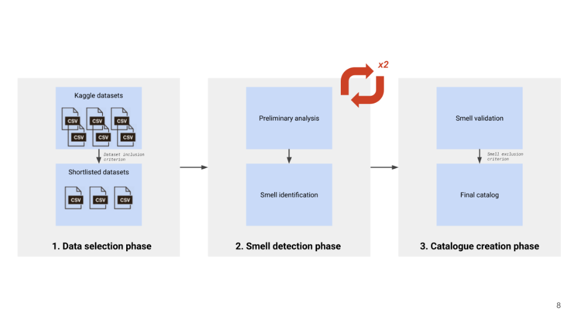
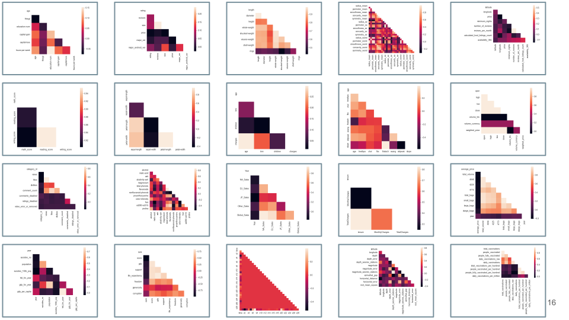
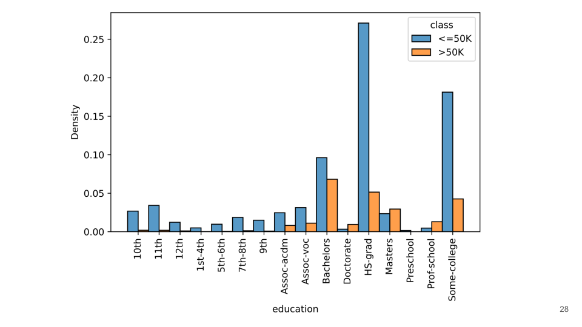
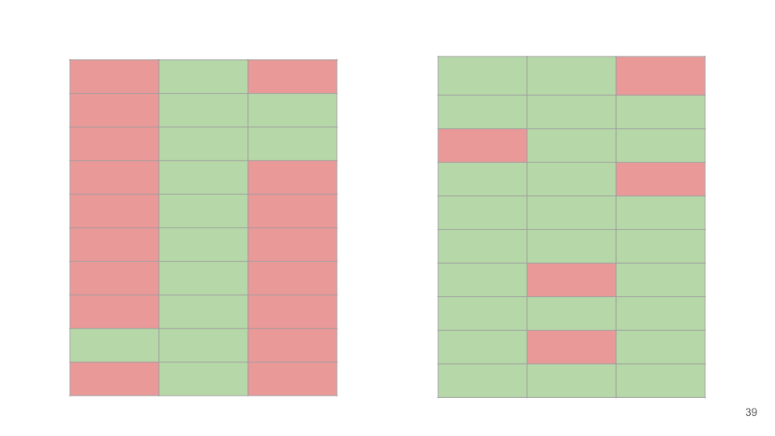

# Introduction

In this talk I will present our recent paper titled *Data Smells in
Public Datasets* which was published at the *[1^st^ International
Conference on AI Engineering (CAIN)
2022](https://conf.researchr.org/home/cain-2022)*. I will first
present the problem we are trying to solve along with the
contributions that we made. I will present the methodology which was
followed along with the results obtained. I will present a select few
smells which I personally find interesting & hope will generate some
discussion. Finally, we will conclude the talk with some high level
takeaways from our study along with the limitations & future
directions of work.

# Problem & Contributions

{#fig-ml-pillars}

Compared to traditional software systems---which typically mature by
experiencing change in the *code*---machine learning systems
experience change in the *code, model & data* (Figure
@fig-ml-pillars). These three pillars of change are tangled with one
another, where a small change or bug in any part of the pipeline,
ripples through to the downstream stages. Thus it becomes extremely
important to catch such problems in the early, upstream stages of the
ML lifecycle, which typically revolve around the data.

ML tends to be very data-centric in nature and majority of the work
involves working with the data. When we put a software engineering
lens on this, **data for data science is equivalent to code for
software engineering**. While software engineers have several tools &
techniques to aid them in their day-to-day lives, the same cannot be
said for data scientists.

With this study, we wish to aid data scientists with their day-to-day
tasks. In line with this motivation, we first identify the recurrent
data quality issues that occur in popular public datasets. Our
contributions here was to provide a formal definition of data smells
which we define as data anti-patterns in the datasets that may
indicate early signs of problems or technical debt. Our second
research question was to analyse the prevalence of such data smells in
public datasets. Here we contributed by creating a catalogue of 14
data smells by analysing 25 popular public datasets.

# Methodology

{#fig-method}

As seen in Figure @fig-method, our methodology consists of 3 distinct
phases.

We start with the data selection phase. We used Kaggle---a popular
public data repository--to identify datasets for this study. We
consider structured datasets with the most number of votes which are
lesser than 1GB in size for this study.

Next we manually conduct a preliminary analysis of the datasets. This
consists of observing the `head`, the `tail` & the descriptive
statistics of the dataset, reading the data documentation when
available and such. Through the preliminary analysis we identify the
data smells. We conduct this phase twice to ensure that the older
datasets are also tagged with relevant smells which were discovered
during analysis of newer datasets.

Finally we conduct the catalogue creation phase. We hold all the data
smells identified in the prior phase against a few exclusion criterion
and create the final catalogue.

# Results

{#fig-2d-histplot}

Figure @fig-2d-histplot is a two dimensional histogram with an
overview of the "meta" analysis of the datasets & smells. The plot
presents the datasets along the X axis and the smells along the Y axis
which allows us to observe the most frequent smells and where they
were recorded. The plot also consists of two marginal plots. The
marginal plot along the Y axis presents a count of smells across all
datasets while the plot along the X axis presents the count of smells
in each dataset.

# Catalogue

I will present 5 smells from the catalogue which I personally find
interesting and hope will spark some discussion.

##  Correlated Features

{#fig-red-corr}

I will start with the presence of correlated features smell which many
of us are perhaps already familiar with. I want to start with this
smell as it was most frequently observed in our sample of datasets.

When two features A & B are correlated, inducing a positive or
negative change in A does the same in B. This presents an opportunity
to perform feature engineering and construct a more efficient dataset.
ML is highly experimental and any optimisation---no matter how
smalls---counts. Small datasets ultimately are easier to understand,
faster to train a model on & take up less storage.

## Presence of Sensitive Features

{#fig-misc-sensitive}

I want to motivate this smell with this figure. This is a probability
density plot from the adult census dataset. This dataset consists
information regarding individuals including their race & sex. The
supervised learning task is to predict the income class they belong
to.

Lets focus primarily on the top left plot which shows that for this
dataset, a male individual of fairer skin is likely to earn more. Such
a bias also exist between male & female individuals of the same race.
A model trained & tested on this dataset will perform well however
putting such a model in production will result in devastating
consequences since the model was trained using biased historical data
which does not reflect the real world.

And we see examples of this in the real world, when financial
institutes use ML to predict if an individual is entitled to a loan,
or when the criminal justice system want to predict the severity of
sentencing and when police try to identify if an individual is a
threat using video surveillance.

## Hierarchy from Label Encoding

{#fig-cat-hierarchy}

Figure @fig-cat-hierarchy presents a probability density plot from the
adult census dataset. Here we compare the income class of individuals
to their level of education. We can see that for this dataset, an
individual with a higher level of education is likely to earn more.

Such a hierarchy in categorical features is useful information which
can be utilised by the model. A common practise is to encode
categorical features using numbers. As an example we can encode the
education levels using numbers between 0 and 4, where higher education
gets a larger number. Such an encoding scheme can be beneficial to the
model as it exposes the hierarchy amongst the values of a categorical
feature. However applying the same encoding scheme for the *race* or
*sex* feature can introduce an unwanted hierarchy amongst the values
where non should exist.

## Binary Missing Values

{#fig-misc-bin}

Two features from the permit dataset contain a lot of missing values
(over 90% of the data in these features are missing). A common
technique in such cases is to drop such features since they do not
impart any knowledge to the model. However, taking a closer look at
the value of the non-missing data, we find that the missing values in
these features carry an implicit meaning of 'no' or a negative
response.

Attention must be paid to the distribution of the missing values. If
the missing values are concentrated within a specific feature (along
columns) as opposed to being evenly distributed across the dataset
(along columns & rows), it may indicate that they carry an implicit
meaning. A novice data scientist may hastily drop such features
however in doing so they alter the original information portrait by
dataset.

## Strings in Human-friendly Formats

{#fig-str-human}

The *netfix* dataset contains information regarding content on the
popular entertainment streaming service. The dataset contains
information regarding movies & TV shows along with their duration.

Although the duration for movies can be easily converted to a
numerical representation, doing the same for TV shows poses several
challenges and requires further effort and domain expertise.

# Discussion

In this section I will present two high level observations from this
study.

## Lack of Proper Documentation

We saw several instances where a lack of proper documentation was
felt. The *heart* dataset contains very cryptic column names and
understanding the information contained within these column require
domain expertise. The *sex* feature within the same dataset is label
encoded however we do not know which number represents which gender.
The *cancer* dataset contains several numerical features but we do not
know the unit in which the measurements were recorded.

Every dataset is unique & contains its own idiosyncrasies and we
require proper documentation to understand them. Documentation
provides useful metadata & context to data scientists who are getting
started with a dataset & also help re-familiarise them to the dataset
quickly when they come back at a later time.

## Lack of Best Practices

We also found several instances of technical debt from lack of best
practices in upstream processes. Going back to the *netflix* dataset
where extracting numerical duration for TV shows was found to be
challenging, or the *heart* dataset with its cryptic column names and
the *cancer* dataset where the unit was not recorded. In all these
instances, technical debt could have been avoided by simply using
better column names or providing documentation. By following
standardised procedures in the upstream data collection/creation
stages, technical debt in the downstream stages can be avoided.

We feel that data smells can help identify such sources of technical
debt in the early stages of a ML pipeline where the complexity is
relatively lower, and fixes are cheaper and easier to implement. This
becomes especially important when working with external stakeholders
within financial constraints.

# Limitations & Future Work

Lets take a look at the limitations of our current study and
directions for future work.

## Limitations

We opted for a *shallow* as opposed to a *deep* analysis of this
datasets. This means that we did not fit a model to each dataset and
carry out a supervised learning task. While such a workflow may reveal
more smells, we believe that the smells also become specific to the
dataset, model or problem we are trying to solve. Our intention was to
pick the smallest subset of analysis tasks that can be scaled across
several datasets.

The smells are linked to the version of the dataset analysed.
Unfortunately this is true for all data-centric work. However we do
our best to make our results reproducible by providing the version of
the data that was analysed in our paper.

We do not know the impact of the smells. For instance, if we consider
the missing units smell, we do not know if and to what extent this
smell affects the performance of a model. This was considered beyond
the scope of this project however remains to be a viable extension to
our current work.

Finally, smells are subjective to the human. But this is true for code
smells as well. Not all long methods are bad and god classes still
exist in public software projects.

## Future Work

Growing the catalogue using more datasets is a low-hanging fruit. It
would also be interesting to explore the notion of smells for
semi-structured and unstructured datasets. Finally, it would be
interesting to understand the co-occurance and evolution of smells
throughout the ML lifecycle.
