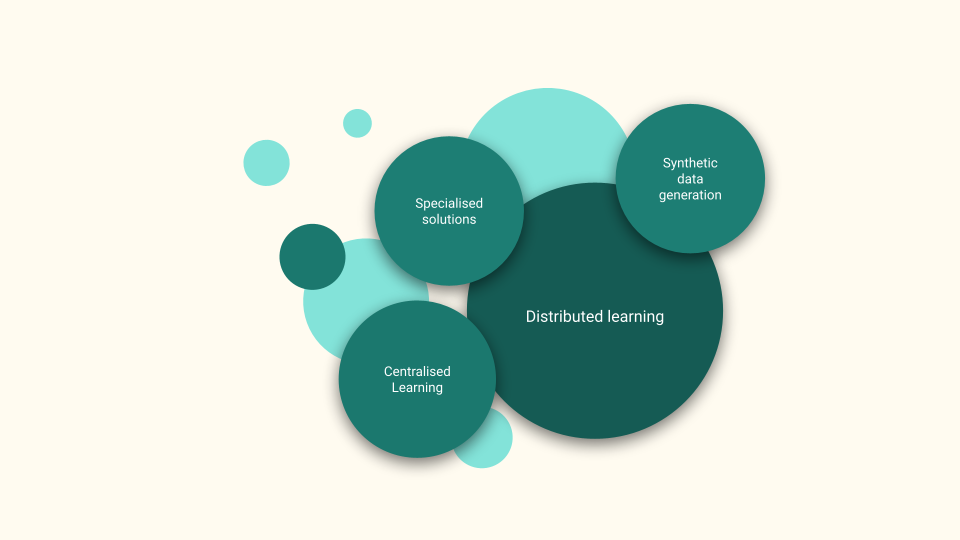
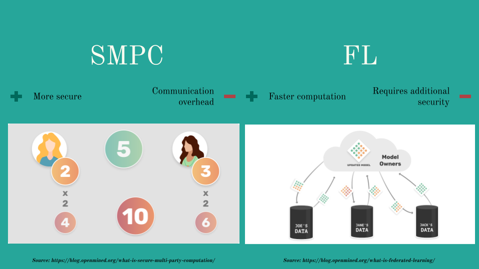
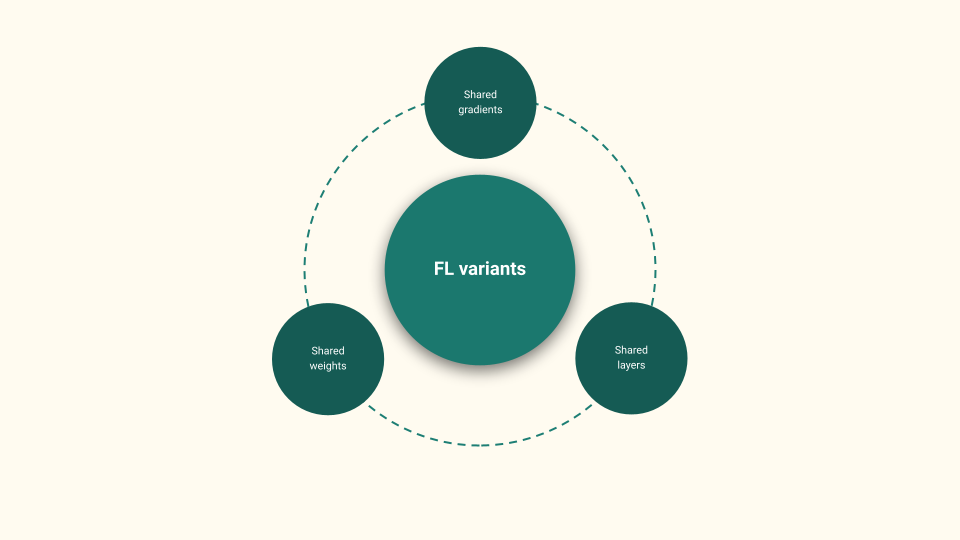

Good morning all, thank you for being here. Today I wanted to share my
research on Privacy Preserving Deep Learning (PPDL) which I conducted
during my Msc. As an example, we will be looking specifically at PPDL
for Medical Image Analysis (MIA). However, I think that this field of
research is highly relevant these days and the techniques can be
applied to any domain working with sensitive data (such as governance,
finance and others).

# Introduction

Medical Imaging is the process of generating an internal
representation of a human body (using MRI, CT or PET scans) for
further analysis in order to detect anomalies (if any exist).

## Challenges of MIA

MIA concerns itself with the study of medical images in order to
determine Regions of Interest(ROI) and image segmentation. MIA is
usually performed by radiologists and requires intensive training and
practise. For each patient, a radiologist may have to inspect more
than 100 images. This is a repetitive task and may pose a cognitive
strain, making the process prone to human errors.

MIA is limited by the skills and cognitive fitness of the human
performing the analysis. While humans may not be so good in performing
repetitive tasks, machine will do them tirelessly and consistently.

This is where Deep Learning (DL) comes into the picture. DL gained
popularity and momentum both in the industry and academia due to it's
success with image classification through the ImageNet challenge. It was
soon adopted not only within MIA but also other fields of medical
science. Although this is an active field of research, several
challenges remain. One of the challenges is to train DL models without
violating the privacy of the patients.

## Challenges of DL in MIA

DL models require a lot of data for training, generally the more data
used, better the prediction results. However, this quantity of data
may not always be available at a single medical institute (for
instance at small hospitals located in remote locations). Larger
institutes who have sufficient data are able to train models however
these models are subjected to bias. This is because the data does not
accurately represent the entire population. Moreover, if the institute
is specialized in a specific disease or observes a disease more
frequently due to it's unique geographic location, the data is biased.

Thus DL models need to be trained using data from several institutes.
The traditional server-client architecture posses several privacy and
security concerns. Once the institutes upload their data to a server,
they may lose their data governance and ownership rights as the server
may be located in a different geographical location with a different
set of jurisdictions. The data upload and storage procedure may also
not be transparent thus raising concerns regarding it's safety and
security.

Although efforts have been made to create centralized medical data
repositories (eICU Collaborative Research Database and The Cancer
Genome Atlas), data privacy laws such as GDPR in Europe and HIPAA in
the State pose a large overhead. The data in such repositories are
anonymised, but this does not guarantee security against privacy
leaks. Datasets have a unique statistical fingerprint making them
vulnerable to linkage attacks.

Distributed Learning addresses the data ownership and governance
problems of centralised learning. However, it still needs to utilise
data privacy and security techniques to ensure privacy of patient
records. In the following sections of this talk we will take a closer
look at Distributed Learning and data privacy techniques for PPDL.

# Study Design

{#fig-study-design}

The goal of this research project was to conduct a systematic review
of DL systems for MIA which take the privacy of the patients into
account. Figure @fig-study-design presents an overview of the study
design. Emphasis was also put on analysis of these privacy-preserving
techniques to determine those which provide good performance, are
scalable and robust, and provide maximum protection against security
threats. To this end, the following research questions are formulated:

1. What are the existing systems, platforms or techniques that
   facilitate deep learning on medical images that do not invade the
   patient's privacy?
2. What are the top performing DL models being used to perform tasks
   in medical imaging?
3. What are the specific attacks that can compromise the security of
   these systems?
4. What is the amount of data leakage in these systems?

# Background

## Data Privacy Techniques

To date, anonymisation and de-identification remain the predominant
privacy-preserving technique for sharing sensitive information.
Although there are not standardised methods of doing so, we commonly
see 3 techniques in the literature:

1. De-identification or removal of sensitive information from
   datasets. This is not the best solution since it results in loss of
   valuable information which may be useful for analysis/training.
2. Pseudo-anonymisation which replaces sensitive information with
   unique pseudonyms. This is a bit better since we retain the unique
   linkages and correlations between data points which may be of
   interest to us.
3. Anonymisation which simply put means de-identification with a
   cherry on top. A few additional things are done on top of
   de-identification to significantly reduce the probability of
   re-identification.

Differential Privacy (DP) preserves the privacy of patients by
injecting a certain quantity of noise into the data. This allows for
statistical analysis to be conducted without compromising sensitive
information. A trade-off between privacy and performance occurs here.
More perturbations in the dataset give higher privacy however may
negatively affect the model's performance.

The alternative is to encrypt the data or the model parameters. The
state-of-the-art encryption schemes cannot be cracked using brute
force techniques making them the most secure means of sharing
sensitive information. The Homomorphic Encryption (HE) scheme allows
certain operations (such as addition, subtraction and multiplication)
to be carried out directly over the cyphertext. This is beneficial for
neural networks as models can be trained directly using encrypted,
unperturbed data with additional computational overhead.

## Security Threats & Attacks

Anonymisation techniques are built into MIA software which may
explains their popularity. However, anonymised data contain unique
statistical fingerprints which make them vulnerable to linkage
attacks. A famous example is the Netflix Prize Dataset where
researchers were able to combine Netflix's anonymised user
subscription data with the imdb public dataset to identify specific
people along with their political preferences and other sensitive
information. Another well known example is linkage attack on
anonymised hospital records from the State of California along with
public voter records to identify the complete medical history of the
Governor of California.

In traditional software, computers strictly follow a specific set of
programmed instructions. In contrast, ML algorithms derive their own
set of rules based on a substantial amount of data provided to them.
This behaviour often leads to neural networks being interpreted as a
black box, preventing users from understanding it's inner workings.
This black box behavior makes neural networks a potential target for
exploitation. This identification of such threats and vulnerabilities
must be prioritised.

These threats can be classified as ones targeting the data and others
targeting the model. Adversarial examples are inputs that are often
indistinguishable from typical inputs, yet contain intentional feature
changes that lead to incorrect classification. Adversarial attacks are
of significance since they question the robustness of DL models. They
can have devastating consequences for DL applications in high-stakes
applications such as medical imaging, facial recognition and
autonomous vehicles.

Data poisoning refers to changing the training data such that the
model can learn with malicious intent and manifest that as it's
predictions. Open access and public datasets are especially vulnerable
to data poisoning. Such datasets are often used to validate
proof-of-concept models by companies or worse, to validate bleeding
edge innovations in research.

In addition to attacks which target the data, the DL model itself can
be exploited. By observing the gradients and parameters of a trained
network, parts of the dataset can be obtained. Model inversion,
membership inference and reconstruction attacks often utilise this
technique to obtain the training data or infer if a public dataset was
used for training. Combined with linkage attacks, the presence of an
individual in a dataset and their sensitive information can be
obtained.

# Results

::: {layout-ncol="2"}
{#fig-training-techniques}

{#fig-distributed-learning}
:::

The study identified 15 papers that presented techniques to train DL
models using sensitive data (summarised in Figure
@fig-training-techniques). The techniques can be broadly classified
as:

1. centralised training,
2. synthetic data generation and
3. distributed training.

The majority of the solutions adopted a distributed training approach
and this is what the rest of the talk will focus upon.

As seen in Figure @fig-distributed-learning Distributed training can
be broadly categorised as

1. asynchronous and
2. synchronous training techniques.

::: {layout-ncol="2"}
{#fig-smpc-fl}

{#fig-fl-variants}
:::

Figure @fig-smpc-fl provides a high-level overview of the asynchronous
techniques. There are predominantly two popular techniques: Federated
Learning (FL) and Secure Multi Party Computing (SMPC). Both techniques
share the same guiding principles. Several models are training in
parallel using the institute's data. The parameters of these models
are then aggregated, usually in a central server, and finally the
aggregated parameters are sent back to the local models.

It's worth nothing that all asynchronous training techniques introduce
additional data privacy through DP or HE to reduce data leakage.

There are several flavours of FL (as seen in Figure @fig-fl-variants),
the most popular being shared gradients and shared weights. However,
there is a third which shows promising results and that is the shared
layers. We will talk more about FL with shared layers later in the
talk.

{#fig-sync-training}

Figure @fig-sync-training presents the three prominent synchronous
training techniques:

1. model ensemble (ME)
2. single weight transfer (SWT) and
3. cyclic weight transfer (CWT)

In ME, models are trained individually at institutes and a final
result is obtained using an ensemble technique (voting, averaging,
etc.). In SWT, a single model is trained at each institute only once
in a pre-determined or random order. CWT extends SWT by training the
model at each institute one or more times.

Empirical evidence suggests that CWT has the best performance and
robust to overfitting. SWT performs second best but is prone to
catastrophic forgetting and ME is least performant.

# Discussion

::: {layout-ncol="2"}
{#fig-sync-async-learning}

{#fig-homomorphic-differential}
:::

As summarised in Figure @fig-sync-async-learning We observe a
trade-off between synchronous and asynchronous learning. Occam's Razor
dictates that CWT being the simpler solution be chosen where possible.
However, as we scale the number of institutes, after a certain
threshold, the added complexity of asynchronous learning becomes
feasible. This threshold is however unknown. Research is also lacking
to determine the scalability of asynchronous learning techniques.

Coming to data privacy techniques, DP and HE are observed to be the
most popular techniques for data privacy. DP introduces a trade-off
between the model's performance by injecting noise into the parameters
for better privacy.

In contrast, HE enables model training over unperturbed and encrypted
parameters. The performance-privacy trade-off is lifted in lieu of
added computational costs. It is recommended to use HE when privacy is
of the utmost importance and runtime is not of significant.

{#fig-pyramid}

Figure @fig-pyramid presents an overview of the findings of this
literature survey. Distributed Learning is able to drastically reduce
the data leakage compared to centralised learning however they are
still vulnerable to model inversion and inference attacks. Additional
security can be provided using DP and HE for the model parameters. HE
is resistant to brute force attacks. However if an attacker obtains a
significant quantity of the plaintext and the corresponding
cyphertext, the encryption can be cracked. Even if we secure the model
parameters, the data itself is still vulnerable to adversarial attacks
and data poisoning.

PPDL is felt to be paradoxical in nature. Although the field aims to
develop learning techniques which respect the patient's privacy, such
data is not easily available. The existing research is thus limited to
experiments conducted using centralised data repositories which do not
accurately represent the domain shift which is observed in a truly
distributed dataset. The result is also limited primarily to MLPs and
CNNs using SGD to perform classification tasks. There is need for
training other network architectures (GNNs and RNNs) using modern
optimization algorithms such as AdaGrad, Adam and RMSProp.

If such a distributed system is built, the ownership of such a system
is unclear. Who would be responsible for it's construction and
maintenance? How will the project be funded? And where will the
parameter server be located? Such a project requires a joint
initiative from all participating institutes but also warrants the
development of legislative policies to ensure a fair and conflict free
operation. Small medical institutes have the most to gain from such an
infrastructure however concerns regarding their access is raised since
they are unable to participate.

# Conclusion

{#fig-summary}

We observe the following lifecycle of PPDL, summarised in Figure
@fig-summary. We start with data owners who are geographically
distributed and protected by different privacy laws & regulations. We
can use distributed learning techniques which result in a better model
performance without compromising data ownership and drastically
reducing data leakage compared to centralised learning. The risks of
inversion and inference attacks can be minimised with data privacy
techniques however we must also safeguard the data itself as it's
vulnerable to adversarial attacks and data poisoning.

# Future Work

I want to end this talk by highlighting some of the interesting
opportunities of research in PPDL.

FL with shared gradients or weights communicate twice: once to send
the local parameters and again to download the aggregated parameters.
Scaling the number of participants of increasing the depth of the
networks raises several challenges. In the shared layers scheme, the
local models have the input and the first hidden layer (L^input^ &
L^1^). The remaining hidden layers are kept in the central server
(L^2^..L^n^). Although the local models communicate twice as much,
since they only transmit the parameters of a single layer (as opposed
to the entire model), the communication overhead is significantly
reduced. Since majority of the layers reside in a central server,
hardware upgrades are only required in the central server for
performance gains. Empirical results are however lacking to compare
and contrast them with shared gradients.

By and large, Medical Imaging data such as MRI and CT scans, are
volumetric in nature. The state-of-the-art solutions require the three
dimensional data be segmented into a two dimensional format, resulting
in loss of valuable information. Geometric Deep Learning (GDL) is a
new field of research, focused on developing deep learning models
which are able to train using volumetric data. As such, the
application of GDL to MIA remains open for further investigation.

The exact inner workings of neural networks are still unclear, thereby
raising serious ethical concerns regarding their application in
medical science. Hybrid intelligence is a new field of research which
seeks to enhance the human intellect using artificial intelligence,
rather than replacing it. Additionally, Bayesian Deep Learning is
another exciting field of research which is tasked with the creation
of DL models that provide a measure of uncertainty to the predictions
they make. Developments in these field may be beneficial to
privacy-preserving deep learning since it will enable humans to view
the outcomes of neural networks with a sense of trust.

