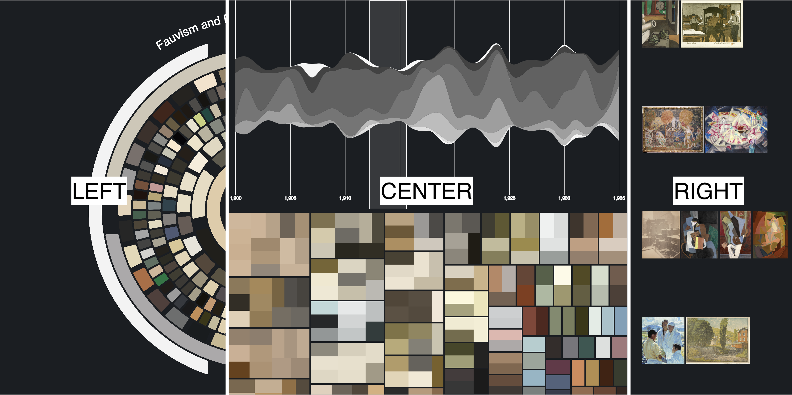
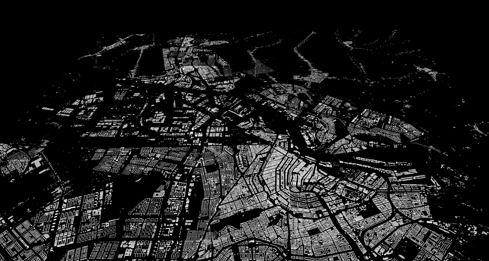

This is a collection of data visualisations I have created in the past from prior research publications. The title of this post is inspired by the @heer2010tour paper.

# Joint Distribution of Categorical Variables

The following visualisation in @fig-jointplot comes from the very first Conference paper I wrote [@shome2022data]. The paper explored the presence of anti-patterns in popular ML datasets that lead to accumulation of technical debt in the downstream stages of the pipeline.

We curated a catalogue of 14 such anti-patterns or *"data-smells"* and manually analysed their presence in 25 popular ML datasets from Kaggle.

I created the visualisation using a [JointGrid from the Seaborn library](https://seaborn.pydata.org/generated/seaborn.JointGrid.html#seaborn.JointGrid). The visualisation in the main subplot shows the distribution of the data-smells across all datasets that were analysed using a two-dimensional histogram. The visualisations in the marginal subplots shows a histogram of the corresponding categorical variables.

{#fig-jointplot}

# Heatmap of Correlation Between Numerical Variables

::: {.column-screen}
{#fig-heatmap-corr}
:::

The next visualisation comes from our @shome2024data paper. Here we analysed the relationship between data dependent and model dependent fairness metrics. @fig-heatmap-corr shows the results obtained from the empirical study conducted using 8 datasets and 4 ML models.

Each heatmap represents results obtained from a fairness metric (we used *Disparate Impact* and *Statistical Parity Difference*). The ML models are represented along the Y axis, while the datasets are along the X axis. Each block shows the correlation between the data and model variants of the corresponding fairness metric. The statistically significant cases are marked with an asterisk. The strength of the correlation is denoted using color--bright hues of red indicate positive correlation while cooler hues of blue represent negative correlation.

# OmniArt: Sentiments through Colours

::: {.column-screen}

:::

This is from a project where we used the [OmniArt dataset](https://isis-data.science.uva.nl/strezoski/#2) to explore the relationship between colors and emotional tones in art through sentiment analysis. We used NLP techniques to analyze metadata from various artworks, focusing on how colors influence perceived sentiments based on painting descriptions. This work is also published as a conference paper with a video demonstration of the tool [@strezoski2019ace].

We created an interactive tool to allow users from varied backgrounds to intuitively explore the complex relationship between colour usage in art and the emotional sentiments those colours may evoke. In the image, you can see a snapshot of the tool which comprises of several interconnected components designed to facilitate interactive exploration of the data.

These visual components are designed to allow users from varied backgrounds to intuitively explore the complex relationship between color usage in art and the emotional sentiments those colors may evoke. This tool not only aids in art analysis but also makes the process accessible to a broader audience, enhancing understanding through interactive visual storytelling and data-driven insights.

# Buildings of Amsterdam

::: {.column-screen}

:::

This one is from a large-scale data engineering project. Using [2 terabytes of point-cloud data](http://ahn2.pointclouds.nl/), We created 3D models of all buildings in the Netherlands (well, we only managed to create a model for the city of Amsterdam). 

We created an interactive web-based visualization that displays the 3D models of buildings across the Netherlands. Using a map of the Netherlands, we divided the data into tiles representing different areas. We made it into the "Hall of Fame" for the course, you can find an [interactive demo hosted on the course website](https://event.cwi.nl/lsde/2018/showcase_c1.shtml). Fair warning, the demo is pretty bad. So here is an image of the model for the beautiful city of Amsterdam.

