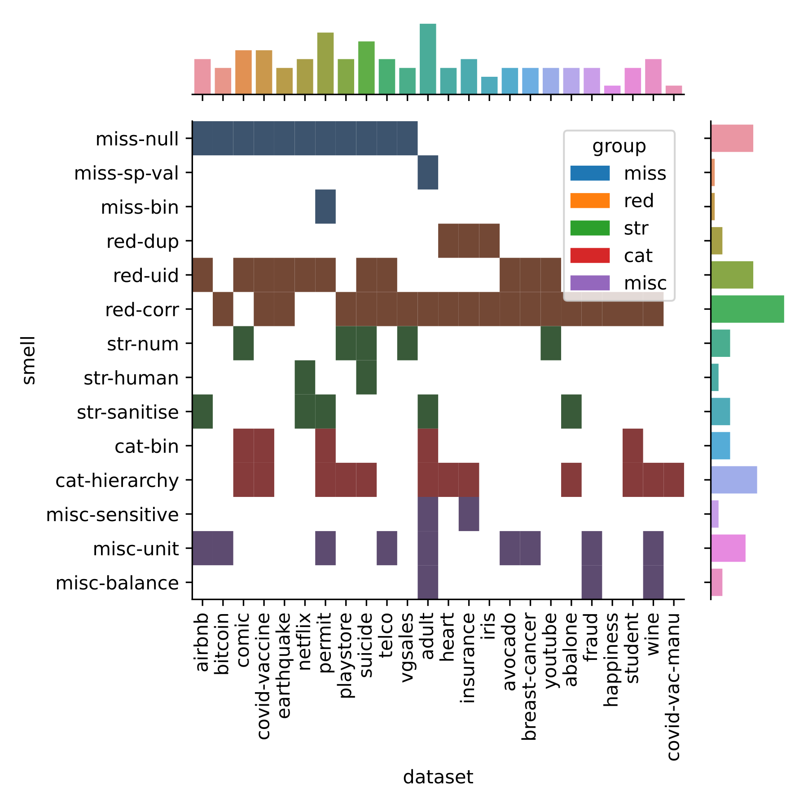
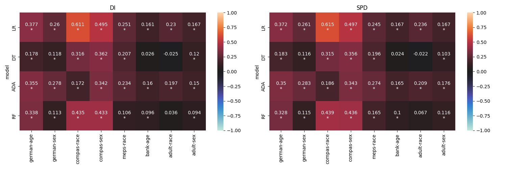

This is a collection of data visualisations I have created in the past from prior research publications. The title of this post is inspired by the @heer2010tour paper.

# Joint Distribution of Categorical Variables

The following visualisation in @fig-jointplot comes from the very first Conference paper I wrote [@shome2022data]. The paper explored the presence of anti-patterns in popular ML datasets that lead to accumulation of technical debt in the downstream stages of the pipeline.

We curated a catalogue of 14 such anti-patterns or *"data-smells"* and manually analysed their presence in 25 popular ML datasets from Kaggle.

I created the visualisation using a [JointGrid from the Seaborn library](https://seaborn.pydata.org/generated/seaborn.JointGrid.html#seaborn.JointGrid). The visualisation in the main subplot shows the distribution of the data-smells across all datasets that were analysed using a two-dimensional histogram. The visualisations in the marginal subplots shows a histogram of the corresponding categorical variables.

{#fig-jointplot}

# Heatmap of Correlation Between Numerical Variables

The next visualisation comes from our @shome2024data paper. Here we analysed the relationship between data dependent and model dependent fairness metrics. @fig-heatmap-corr shows the results obtained from the empirical study conducted using 8 datasets and 4 ML models.

Each heatmap represents results obtained from a fairness metric (we used *Disparate Impact* and *Statistical Parity Difference*). The ML models are represented along the Y axis, while the datasets are along the X axis. Each block shows the correlation between the data and model variants of the correponding fairness metric. The statistically significant cases are marked with an asterisk. The strength of the correlation is denoted using color--bright hues of red indicate positive correlation while cooler hues of blue represent negative correlation.

{#fig-heatmap-corr}

